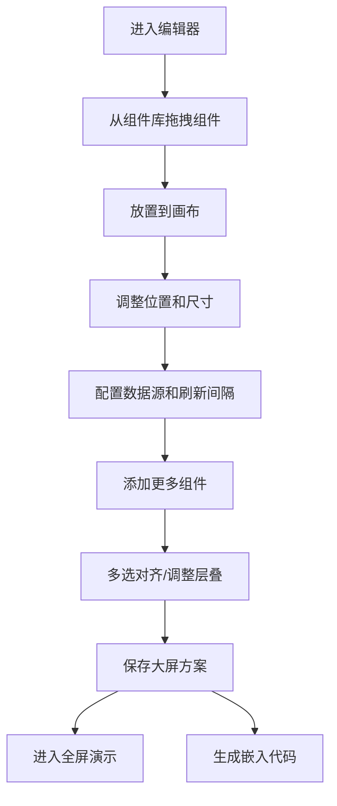

## 1. 产品概述

可视化数据大屏搭建平台是一款零代码大屏配置工具，用户通过拖拽图表组件快速构建数据可视化大屏，支持多种图表类型、自定义数据源配置、实时数据刷新、方案管理和嵌入式集成。

- 核心价值：降低数据大屏开发门槛，快速搭建企业级数据可视化展示大屏
- 目标用户：数据分析师、产品经理、运营人员、企业IT人员

## 2. 核心功能

### 2.1 用户角色

| 角色 | 注册方式 | 核心权限 |
|------|----------|----------|
| 普通用户 | 无需注册，本地存储 | 大屏编辑、保存、预览、导出嵌入代码 |

### 2.2 功能模块

1. **组件库面板**：折线图、柱状图、饼图、数字翻牌器、地图热力图
2. **画布编辑区**：拖拽放置、调整尺寸、多选、对齐、层叠顺序
3. **配置面板**：数据源配置、样式配置、刷新间隔
4. **方案管理**：保存多份大屏方案、加载、删除
5. **演示模式**：全屏预览、实时数据刷新
6. **嵌入代码生成**：iframe 方式集成到第三方页面
7. **撤销/重做**：操作历史记录与回退

### 2.3 页面详情

| 页面名称 | 模块名称 | 功能描述 |
|----------|----------|----------|
| 编辑器主页 | 左侧组件库 | 展示可拖拽的图表组件列表 |
| 编辑器主页 | 中间画布区 | 大屏编辑画布，支持拖拽放置和调整 |
| 编辑器主页 | 右侧配置面板 | 选中组件的属性和数据源配置 |
| 编辑器主页 | 顶部工具栏 | 保存、预览、撤销/重做、对齐工具 |
| 演示模式页 | 全屏画布 | 无工具栏的纯大屏展示 |
| 方案管理弹窗 | 方案列表 | 已保存方案的管理操作 |

## 3. 核心流程

用户从组件库拖拽组件到画布 → 调整组件位置和尺寸 → 配置组件数据源与刷新间隔 → 继续添加更多组件 → 调整组件对齐和层叠顺序 → 保存大屏方案 → 进入全屏演示或导出嵌入代码

## 4. 用户界面设计

### 4.1 设计风格

- 主色调：深邃科技蓝 (#0A1628) 搭配霓虹青 (#00F5FF) 作为强调色
- 辅助色：紫色渐变 (#7B61FF) 用于高亮交互元素
- 整体风格：暗色科技感大屏风格，深色背景 + 发光边框 + 渐变点缀
- 字体：标题使用 Orbitron 科技感字体，正文使用 Inter
- 按钮风格：圆角胶囊按钮，带发光悬停效果
- 布局：三栏布局（左组件库 + 中画布 + 右配置面板）
- 图标：lucide-react 线性图标

### 4.2 页面设计概述

| 页面名称 | 模块名称 | UI 元素 |
|----------|----------|---------|
| 编辑器主页 | 左侧组件库 | 卡片式组件预览，悬停发光效果 |
| 编辑器主页 | 中间画布 | 网格背景，选中组件蓝色高亮边框 |
| 编辑器主页 | 右侧配置面板 | 分组折叠面板，表单控件 |
| 编辑器主页 | 顶部工具栏 | 图标按钮组，方案下拉选择 |
| 演示模式页 | 全屏画布 | 无边框全屏展示，右下角退出按钮 |

### 4.3 响应性

- 桌面端为主，画布固定比例缩放
- 配置面板支持折叠
- 演示模式自适应全屏

### 4.4 视觉动效

- 组件拖拽时半透明预览
- 选中组件边框呼吸灯效果
- 数字翻牌器数字滚动动画
- 图表数据切换过渡动画
- 操作按钮悬停发光效果
