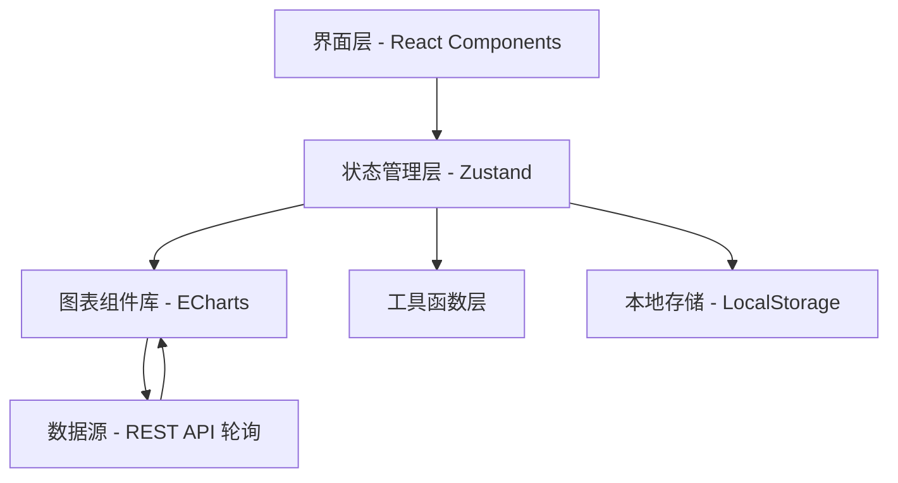
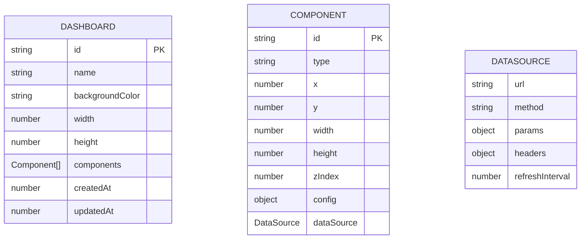

## 1. 架构设计



## 2. 技术描述

- 前端框架：React@18 + TypeScript + Vite
- 样式方案：TailwindCSS@3
- 状态管理：Zustand
- 图表库：ECharts@5
- 图标库：lucide-react
- 数据存储：LocalStorage（纯前端，无需后端）
- 初始化工具：vite-init

## 3. 路由定义

| 路由 | 用途 |
|------|------|
| / | 大屏编辑器主页 |
| /preview/:id | 大屏预览/演示模式 |
| /embed/:id | iframe 嵌入模式 |

## 4. 数据模型

### 4.1 数据模型定义



### 4.2 组件类型定义

```typescript
type ComponentType = 'line' | 'bar' | 'pie' | 'number' | 'heatmap';

interface ComponentConfig {
  title?: string;
  color?: string[];
  [key: string]: any;
}

interface DataSource {
  url: string;
  method: 'GET' | 'POST';
  params: Record<string, string>;
  headers: Record<string, string>;
  refreshInterval: number;
}

interface DashboardComponent {
  id: string;
  type: ComponentType;
  x: number;
  y: number;
  width: number;
  height: number;
  zIndex: number;
  config: ComponentConfig;
  dataSource: DataSource;
}

interface Dashboard {
  id: string;
  name: string;
  backgroundColor: string;
  width: number;
  height: number;
  components: DashboardComponent[];
  createdAt: number;
  updatedAt: number;
}
```

## 5. 核心模块

### 5.1 状态管理 Store

- dashboardStore：当前大屏配置、选中组件、操作历史
- 支持撤销/重做（历史记录栈）
- 组件 CRUD 操作
- 多选状态管理

### 5.2 图表组件

- LineChart：折线图组件
- BarChart：柱状图组件
- PieChart：饼图组件
- NumberCard：数字翻牌器
- HeatMapChart：地图热力图
- 统一的数据源轮询 Hook

### 5.3 画布交互

- 拖拽放置（从组件库拖到画布）
- 移动调整（选中后拖动）
- 尺寸调整（边角拖拽）
- 多选框选
- 对齐操作（左对齐、右对齐、居中、上对齐、下对齐、垂直居中）
- 层叠顺序（上移一层、下移一层、置顶、置底）

### 5.4 工具函数

- 唯一 ID 生成
- 本地存储封装
- 坐标计算
- 数据适配（将 API 返回数据转换为图表所需格式）

## 6. 文件结构

```
src/
├── components/
│   ├── charts/           # 图表组件
│   │   ├── LineChart.tsx
│   │   ├── BarChart.tsx
│   │   ├── PieChart.tsx
│   │   ├── NumberCard.tsx
│   │   └── HeatMapChart.tsx
│   ├── canvas/           # 画布相关
│   │   ├── Canvas.tsx
│   │   ├── CanvasItem.tsx
│   │   └── ResizeHandle.tsx
│   ├── panels/           # 面板组件
│   │   ├── ComponentPanel.tsx
│   │   ├── ConfigPanel.tsx
│   │   └── Toolbar.tsx
│   └── common/           # 通用组件
├── hooks/                # 自定义 Hooks
│   ├── useDragDrop.ts
│   ├── useDataSource.ts
│   └── useHistory.ts
├── store/                # 状态管理
│   └── dashboardStore.ts
├── types/                # 类型定义
│   └── index.ts
├── utils/                # 工具函数
│   ├── storage.ts
│   └── helpers.ts
├── pages/                # 页面
│   ├── Editor.tsx
│   ├── Preview.tsx
│   └── Embed.tsx
├── App.tsx
└── main.tsx
```
